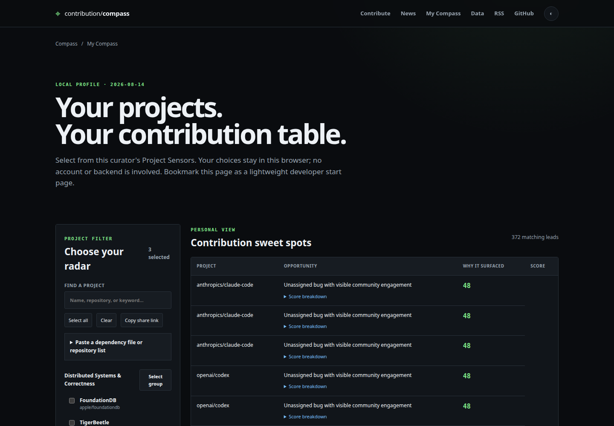

# Contribution Compass — OSS updates and contribution opportunities

[](https://github.com/amk9978/contribution-compass/actions/workflows/ci.yml)
[](https://amk9978.github.io/contribution-compass/)
[](https://github.com/amk9978/contribution-compass/releases)
[](LICENSE)

Contribution Compass is a GitHub Actions-powered open-source project monitor and contribution
finder. It tracks important issues, pull requests, releases, roadmaps, and Hacker News discussions,
then publishes static human pages, JSON, RSS, and MCP access.

It is a data gatherer first. GitHub evidence, separately labeled Hacker News discussions,
repository context, and observation history stay separate from interpretation. No OpenAI,
Anthropic, or other model credential is required.

## Quick start

**Explore immediately — no install, account, or fork:**
[open My Compass](https://amk9978.github.io/contribution-compass/personalize/), choose your projects,
and bookmark the page.

**Run your own compass:**

1. [Create a repository from the template](https://github.com/new?template_name=contribution-compass&template_owner=amk9978).
2. Edit `config.yml` with the projects and keywords you care about.
3. Enable GitHub Actions and select **GitHub Actions** as the Pages source.
4. Run the **Contribution Compass** workflow once from the Actions tab.

That is all. GitHub collects updates on schedule and publishes the website, JSON, RSS, and MCP
catalog. **No OpenAI or Anthropic API key is needed.**

### See it in action

[](https://amk9978.github.io/contribution-compass/personalize/)

_Choose projects, inspect evidence-backed contribution leads, and bookmark the result as a local
developer start page._

```text
config.yml Project Sensors
        ↓
GitHub issues, pull requests, releases, milestones, and project metadata
        + current Hacker News discussions matched to configured projects
        ↓
normalized Signals + append-only Observation Events
        ↓
folder-separated JSON catalog
        ↓
human pages · JSON/feeds · CLI · MCP
        ↓
optional evidence-citing Inference Extensions
```

## Why it exists

A list of repository activity is not enough. Contribution Compass helps answer:

- What important projects changed recently?
- What major developments shipped in their latest stable releases?
- What prereleases or milestones publicly indicate where a project is heading?
- Where are Hacker News readers discussing these configured projects?
- Which issues explicitly invite community help?
- Which unassigned issues may be worth discussing with maintainers?
- What context surrounds the project and issue?
- How do curated projects compare on collected facts without a composite score?
- When was a Signal discovered, and what changed afterward?

Contribution Leads are conservative and transparent:

- **Maintainer-Invited:** an open, unassigned issue labeled `good first issue`, `help wanted`, or an
  equivalent explicit invitation.
- **Triage Lead:** unassigned documentation work or an engaged bug/enhancement without explicit
  maintainer invitation.

Closed, assigned, stale, duplicate, invalid, blocked, question, needs-info, and needs-reproduction
issues are excluded. A lead is not a guarantee of difficulty or acceptance; check the live issue and
talk to maintainers before substantial work.

Every Lead also contains an additive score breakdown. Named Contribution Measures show exactly
which label, activity, engagement, or eligibility fact contributed each point. The label sets,
weights, thresholds, and recency window form a Contribution Policy in `config.yml`; they are
curator-controlled heuristics, not generated judgments.

## Evidence and history

Each repository dataset contains:

- Project Context: description, topics, language, license, default branch, stars, forks, and activity;
- normalized issue, pull-request, and release Signals;
- direct URLs to original GitHub evidence;
- append-only Observation Events containing discovered/changed snapshots and changed fields;
- collection-run metadata;
- a Project News Snapshot with its latest stable release and publicly visible upcoming items; and
- current matched Hacker News stories with article and discussion URLs, score, comments, and match
  reason.

Hacker News is shown as community discussion, never as maintainer evidence. The collector uses the
official `topstories` and `beststories` lists, applies the configured lookback and item cap, and does
not crawl the full comment tree.

```text
data/
  2026-08-13/
    manifest.json
    distributed-systems/
      foundationdb.json
      tigerbeetle.json
```

Data remains separated by date, group, and repository. Empty configuration groups stay empty; the
loader never inserts hidden defaults.

## Human and machine access

- Website: <https://amk9978.github.io/contribution-compass/>
- Project comparison: <https://amk9978.github.io/contribution-compass/projects/>
- Project comparison API: <https://amk9978.github.io/contribution-compass/api/v1/projects.json>
- My Compass browser profile: <https://amk9978.github.io/contribution-compass/personalize/>
- Contribution view: <https://amk9978.github.io/contribution-compass/contribute/>
- Project news: <https://amk9978.github.io/contribution-compass/news/>
- Machine catalog: <https://amk9978.github.io/contribution-compass/api/v1/index.json>
- Project news API: <https://amk9978.github.io/contribution-compass/api/v1/news.json>
- Project news JSON Feed: <https://amk9978.github.io/contribution-compass/news/feed.json>
- Project news RSS: <https://amk9978.github.io/contribution-compass/news/feed.xml>
- Contribution leads: <https://amk9978.github.io/contribution-compass/api/v1/opportunities.json>
- JSON Feed: <https://amk9978.github.io/contribution-compass/feed.json>
- RSS: <https://amk9978.github.io/contribution-compass/feed.xml>
- LLM guide: <https://amk9978.github.io/contribution-compass/llms.txt>
- MCP setup: [docs/MCP.md](docs/MCP.md)

LLM-backed tools should use MCP or the versioned JSON catalog instead of scraping visual HTML.

`My Compass` lets a visitor choose projects, paste a dependency file or repository list, and view a
paginated personal contribution/news table. Its selection is stored only in `localStorage` and the
page URL. It can be bookmarked or used as a browser start page; no fork, account, or server is
required.

## Architecture

The Python core uses explicit module seams while avoiding pass-through abstraction:

```text
src/contribution_compass/
  domain/          models, invariants, importance, contribution rules
  application/     collection, catalog-query, and setup use cases
  ports.py         small interfaces implemented by real adapters
  adapters/        GitHub, local/hosted/overlay catalogs, state, persistence
  controllers/     CLI and MCP transports
  views/           Markdown, HTML, JSON, RSS, and LLM navigation
web/assets/        progressive browser CSS/JavaScript only
```

Domain modules know nothing about GitHub HTTP, files, HTML, or MCP. Controllers configure adapters
and invoke application modules. Local and hosted catalogs implement the same read interface. Views
render application results but do not classify opportunities.

See [CONTEXT.md](CONTEXT.md) for domain language and [docs/adr](docs/adr) for architectural decisions.

## Generate `config.yml`

Instead of editing YAML manually, generate a configuration from one or more sources:

```bash
uv sync --all-extras

# Explicit repositories
uv run contribution-compass init --repo apple/foundationdb --repo temporalio/temporal --force

# Repositories behind direct dependencies in a supported manifest
uv run contribution-compass init --from-file go.mod --force
uv run contribution-compass init --from-file package.json --force
uv run contribution-compass init --from-file requirements.txt --force

# Your GitHub stars (requires GITHUB_TOKEN)
export GITHUB_TOKEN="$(gh auth token)"
uv run contribution-compass init --from-starred --starred-limit 100 --force
```

`init` resolves npm and PyPI packages through public registry metadata, recognizes GitHub-backed Go
modules and direct Git dependencies, and reports anything it cannot map unambiguously. It never
guesses a repository silently. Review the generated YAML before the first collection.

## Configure a fork

Edit `config.yml` with arbitrary project groups:

```yaml
lookback_hours: 24

hackernews:
  enabled: true
  story_limit: 200

contributions:
  invitation_labels: [good first issue, help wanted]
  beginner_labels: [good first issue]
  excluded_labels: [blocked, duplicate, stale]
  weights:
    maintainer_invitation: 60
    recent_activity: 5
  thresholds:
    recent_days: 14

catalog_overlays: []

repo_groups:
  compilers:
    name: Compiler Engineering
    repos:
      - id: llvm
        repo: llvm/llvm-project
        name: LLVM
        paginated: true
        keywords: [LLVM, compiler infrastructure]
```

Each repository ID must be globally unique. `repos: []` and `keywords: []` mean empty. Keywords are
persisted with repository data and participate in update, opportunity, and news searches. They are
also matched against Hacker News story titles, so choose specific phrases to avoid ambiguity. Exact
references to the configured GitHub repository are matched independently. Set
`hackernews.enabled: false` to disable that source while retaining keyword search metadata.

The checked-in `config.yml` shows the complete default Contribution Policy. Empty label arrays stay
empty, and setting a weight to zero disables that scoring effect. The generated JSON includes every
activated Contribution Measure and defines `rankScore` as their sum.

### Reuse the public catalog

A fork can avoid recollecting overlapping repositories:

```yaml
catalog_overlays:
  - id: community
    url: https://amk9978.github.io/contribution-compass
    max_age_hours: 48
```

The consumer's `repo_groups` remain authoritative: an overlay cannot introduce unconfigured
projects. Fresh matching snapshots are reused, and only the remaining repository delta is collected.
Equally current local data wins. Stale, incompatible, or unavailable overlays fall back to direct
GitHub collection. JSON and MCP expose Catalog Provenance; checked-in Markdown reports cover the
locally collected delta.

Human pages use static pagination: 20 contribution leads, 10 project-news cards, or 50 project
Signals per page. JSON, RSS, MCP, and direct GitHub/HN links remain available for deeper reading.

## Local use

Requirements: Python 3.12+ and [uv](https://docs.astral.sh/uv/).

```bash
uv sync --all-extras
export GITHUB_TOKEN="$(gh auth token)"
uv run contribution-compass collect
uv run contribution-compass site
uv run contribution-compass doctor --repository owner/repository
```

Query without MCP:

```bash
uv run contribution-compass query opportunities --limit 10
uv run contribution-compass query news --query performance
uv run contribution-compass query updates --query cancellation
uv run contribution-compass query timeline 'github:owner/repo:issue:123'
```

Verification:

```bash
uv run ruff check .
uv run ruff format --check .
uv run mypy src
uv run pytest
uv run contribution-compass site
```

Tests use fixtures and mocks; they make no live GitHub requests.

## GitHub Actions and template setup

The scheduled `Contribution Compass` workflow uses GitHub's built-in `GITHUB_TOKEN`, collects data
from GitHub and the keyless official Hacker News interface, and commits `data/`, `reports/`, and
`.state/`. The Pages workflow publishes all human and machine
views after a successful collection. No extra secret is required.

After creating a repository from the template:

1. Open Settings → Actions → General and ensure Actions are enabled. Read/write default permission
   is convenient; the collection workflow also requests `contents: write` explicitly.
2. Select **GitHub Actions** as the Pages source in Settings → Pages.
3. Generate or edit `config.yml`.
4. Run `uv run contribution-compass doctor --repository owner/repository`.
5. Run the `Contribution Compass` workflow manually once.

GitHub templates copy files and branches, not every repository setting, so the first two checks
cannot be safely assumed. `doctor` verifies local workflow contents and, when the token has suitable
read permissions, inspects the live Actions and Pages settings without changing them.

URLs derive from the fork owner and repository name. Set the optional `SITE_URL` Actions variable
only for a custom domain.

## Contributing

Contributions are welcome. Start with [`good first issue`](https://github.com/amk9978/contribution-compass/labels/good%20first%20issue)
or [`help wanted`](https://github.com/amk9978/contribution-compass/labels/help%20wanted), then read
[CONTRIBUTING.md](CONTRIBUTING.md). Usage questions belong in
[Discussions](https://github.com/amk9978/contribution-compass/discussions); vulnerabilities should
follow [SECURITY.md](SECURITY.md).

## Optional inference extensions

The catalog and MCP interface are the intended seam for future LLM-backed inference. An extension
should write to a separate namespace, record its method/model/run, distinguish inference from direct
evidence, and cite immutable Signal or Observation Event IDs. It must not overwrite evidence.

## Difference from agents-radar

See [docs/COMPARISON.md](docs/COMPARISON.md) for the concise comparison. In short, agents-radar is a
broad AI-news digest with LLM synthesis; Contribution Compass is a Python, domain-agnostic evidence
catalog centered on contribution discovery, project context, and event trails.

## Attribution

Implementation patterns were selectively adapted from the MIT-licensed
[agents-radar](https://github.com/duanyytop/agents-radar). See [NOTICE.md](NOTICE.md) and
[LICENSE](LICENSE).
